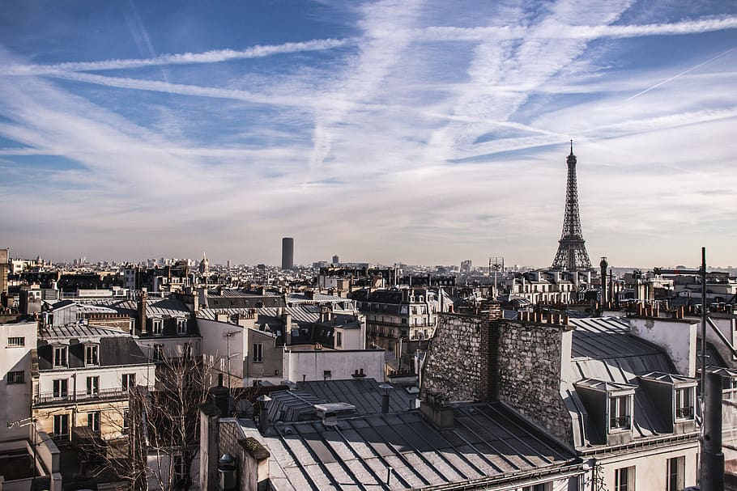
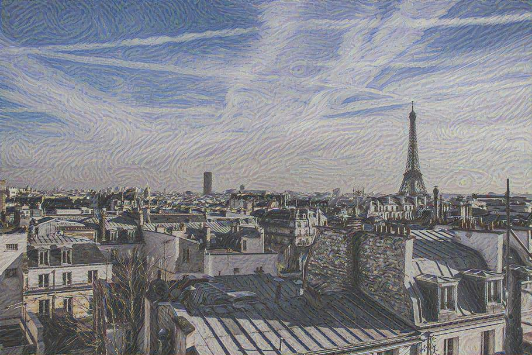
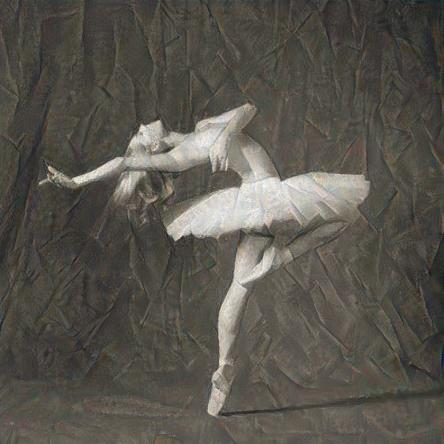

# 🎨 Neural Style Transfer

Перенесите стиль с одного изображения на другое с помощью нейросети **VGG-19** на **PyTorch**

## 🏙️ Примеры

Контент | Стиль | Результат
:--:|:--:|:--:
 |  | 
 |  | 

## 🪛🛠️ Установка

1. Клонируйте репозиторий:
```bash
git clone https://github.com/mishcum/neural-style-transfer.git
cd neural-style-transfer
```
2. Установите зависимости:
```bash
pip install -r requirements.txt
```

## 🚀 Использование
```bash
python main.py --content <path/to/content.jpg> --style <path/to/style.jpg> --output <path/to/result.jpg>
```
### ⚙️ Параметры

* `--content` — путь к изображению, к которому вы хотите применить стиль.
* `--style` — путь к изображению стиля.
* `--output` — путь для сохранения результата (опционально).
* `--epochs` — количество итераций оптимизации (по умолчанию 100).
* `--lr` — learning rate оптимизатора (по умолчанию 0.01).
* `--content-weight` - вес потерь по контенту (по умолчаеию 1.0)
* `--style-weight` - вес потерь по стилю (по умолчаеию 1000.0)

## 🌳 Структура проекта
```
.
├── examples # примеры работы
│   ├── contents
│   │   ├── image1.jpg
│   │   └── image2.jpg
│   ├── results
│   │   ├── image1_stylized.jpg
│   │   └── image2_stylized.jpg
│   └── styles
│       ├── style1.jpg
│       └── style2.jpg
├── loss
│   └── losses.py # функции для расчета потерь
├── main.py # запуск, обработка аргументов
├── models
│   └── model.py # часть обученной модели VGG19
├── README.md # вы тут)
├── requirements.txt # зависимости
├── setup.py # сетап
├── style_transfer.py # перенос стиля
└── utils
    └── image_utils.py # работа с изображениями
```
